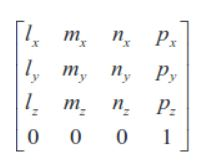
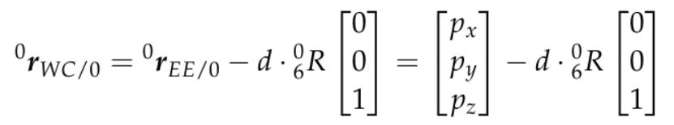
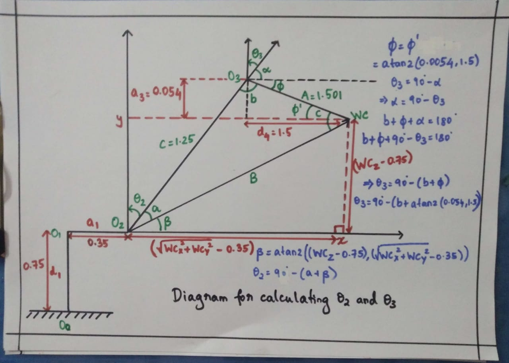
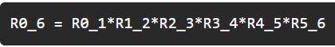
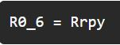
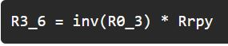
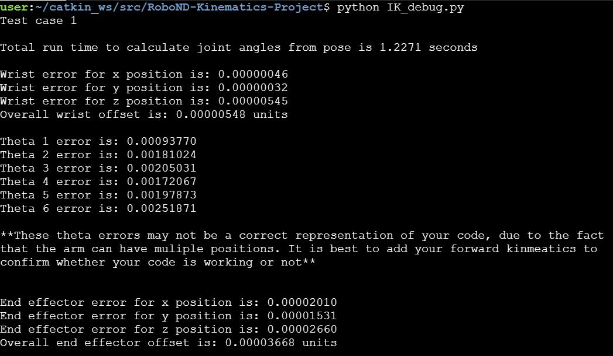

# Project: Kinematics Pick & Place
---  
# Setting up the environment

---


# [Rubric](https://review.udacity.com/#!/rubrics/972/view) Points
## Here I will consider the rubric points individually and describe how I addressed each point in my implementation.  

---
## Kinematic Analysis
### 1. Deriving the DH parameters by analyzing the URDF file
By analyzing the `kr210.urdf.xacro` file, we can get the xyz and rpy value of every joint in the arm. From that, we can calculate the DH parameters. 

DH Parameters  
* α<sub>i-1</sub>(twist angle) = angle between Z<sub>i-1</sub> and Z<sub>i</sub> measured about X<sub>i-1</sub>  
* a<sub>i-1</sub>(link length) = distance between Z<sub>i-1</sub> and Z<sub>i</sub> measured along X<sub>i-1</sub> which is perpendicular to both Z<sub>i-1</sub> and Z<sub>i</sub>
* d<sub>i</sub>(link offset) = signed distance from X<sub>i-1</sub> to X<sub>i</sub> measured along Z<sub>i</sub>  
* θ<sub>i</sub>(joint angle) = angle from X<sub>i-1</sub> and X<sub>i</sub> measured about Z<sub>i</sub>  

For example, from this part of the URDF file,
```xml
<joint name="fixed_base_joint" type="fixed">
    <parent link="base_footprint"/>
    <child link="base_link"/>
    <origin xyz="0 0 0" rpy="0 0 0"/>
  </joint>
```  
From the origin tag, 
```xml
<origin xyz="0 0 0" rpy="0 0 0"/>
```
we can see that for the fixed_base joint, **xyz = "0 0 0"** and **rpy = "0 0 0"**  
Similarly, from the URDF file, we can get the xyz and rpy values of all the joints of the arm  

**Relative location of joint{i-1} to joint{i}**
Joint Name | Parent Link | Child Link | x(m) | y(m) | z(m) | roll | pitch | yaw |
--- | --- | --- | --- | --- | --- | --- | --- | --- | 
joint_1 | base_link | link_1 | 0 | 0 | 0.33 | 0 | 0 | 0 |
joint_2 | link_1 | link_2 | 0.35 | 0 | 0.42 | 0 | 0 | 0 |
joint_3 | link_2 | link_3 | 0 | 0 | 1.25 | 0 | 0 | 0 |
joint_4 | link_3 | link_4 | 0.96 | 0 | -0.054 | 0 | 0 | 0 |
joint_5 | link_4 | link_5 | 0.54 | 0 | 0 | 0 | 0 | 0 |
joint_6 | link_5 | link_6 | 0.193 | 0 | 0 | 0 | 0 | 0 |
gripper-joint | link_6 | gripper_link | 0.11 | 0 | 0 | 0 | 0 | 0 |  

From this table, we can make a figure of the arm from which we can calculate the DH parameters


From this figure, we can create the DH table 
Links | i | alpha(i-1) | a(i-1) | d(i-1) | theta(i)
--- | --- | --- | --- | --- | --- 
0->1 | 1 | 0 | 0 | 0.75 | q1
1->2 | 2 | - pi/2 | 0.35 | 0 | -pi/2 + q2
2->3 | 3 | 0 | 1.25 | 0 | q3
3->4 | 4 | -pi/2 | -0.054 | 1.5 | q4
4->5 | 5 | pi/2 |0 | 0 | q5
5->6 | 6 | -pi/2 | 0 | 0 | q6
6->EE | 7 | 0 | 0 | 0.303 | q7

In the code, the parameters are represented in the following way
```python
# Create symbols
alpha0, alpha1, alpha2, alpha3, alpha4, alpha5, alpha6 = symbols('alpha0:7')
a0, a1, a2, a3, a4, a5, a6 = symbols('a0:7')
d1, d2, d3, d4, d5, d6, d7 = symbols('d1:8')
q1, q2, q3, q4, q5, q6, q7 = symbols('q1:8')    
#   
# Create Modified DH parameters
DH_Table = {alpha0: 0, 	    a0: 0, 		d1: 0.75, 	q1: q1,
		            alpha1: -pi/2., a1: 0.35,	d2: 0, 		q2: -pi/2. + q2,
		            alpha2: 0, 	    a2: 1.25, 	d3: 0, 		q3: q3,
		            alpha3: -pi/2,  a3: -0.054, d4: 1.5, 	q4: q4,
		            alpha4: pi/2, 	a4: 0, 		d5: 0, 		q5: q5,
		            alpha5: -pi/2., a5: 0, 		d6: 0, 		q6: q6,
		            alpha6: 0, 	    a6: 0, 		d7: 0.303, 	q7: 0}
```


### 2. Creating individual transformation matrices about each joint and also a generalized homogeneous transform between base_link and gripper_link using only end-effector(gripper) by using the DH table derived.  
DH convention uses four individual transforms,   
### <p align = "center"> <sup>*i*-1</sup><sub>*i*</sub>T = R(x<sub>*i*-1</sub>,α<sub>*i*-1</sub>)T(x<sub>*i*-1</sub>,a<sub>*i*-1</sub>)R(z<sub>*i*</sub>,θ<sub>*i*</sub>)R(z<sub>*i*</sub>,d<sub>*i*</sub>) </p>
to describe the relative translation and orientation of link (i-1) to link (i). In matrix form, this transform is,  


Now to get the individual transformation matrices, we write a function that takes in the DH parameters and returns the transformation matrix
```python
# Define Modified DH Transformation matrix
def DH_tfmat(alpha, a, d, q):
	TF = Matrix([
		[cos(q), 		       -sin(q), 		     0, 		     a],
	        [sin(q)*cos(alpha), 	cos(q)*cos(alpha), 	-sin(alpha), 	-sin(alpha)*d],
	     	[sin(q)* sin(alpha), 	cos(q)*sin(alpha), 	 cos(alpha), 	 cos(alpha)*d],
	     	[0,			            0,			         0,		         1]
	    ])
	return TF
```
We substitute the DH parameters in the matrix to get the individual transformation matrices
```python
# Create individual transformation matrices
T0_1 = DH_tfmat(alpha0, a0, d1, q1).subs(DH_Table)
T1_2 = DH_tfmat(alpha1, a1, d2, q2).subs(DH_Table)
T2_3 = DH_tfmat(alpha2, a2, d3, q3).subs(DH_Table)
T3_4 = DH_tfmat(alpha3, a3, d4, q4).subs(DH_Table)
T4_5 = DH_tfmat(alpha4, a4, d5, q5).subs(DH_Table)
T5_6 = DH_tfmat(alpha5, a5, d6, q6).subs(DH_Table)
T6_EE = DH_tfmat(alpha6, a6, d7, q7).subs(DH_Table)
```
We multiply the individual matrices to get the homogeneous transform matrix from base_link to gripper_link
```python
T0_EE = T0_1 * T1_2 * T2_3 * T3_4 * T4_5 * T5_6 * T6_EE
```
We can check this matrix with the help of `forward_kinematics.launch` file. We can compare the values of the matrix with the values we get in RViZ to see how accurate the values are  


  

### 3. Decoupling Inverse Kinematics problem into Inverse Position Kinematics and inverse Orientation Kinematics; and deriving the equations to calculate all individual joint angles.  
Since the last three joints in our robot are revolute and their joint axes intersect at a single point, we have a case of spherical wrist with joint_5 being the common intersection point and hence the wrist center. This allows us to kinematically decouple the IK problem into Inverse Position and Inverse Orientation problems as discussed in the Inverse Kinematics. 

The matrix can be represented in the following way  



where l, m and n are orthonormal vectors representing the end-effector orientation along X, Y, Z axes of the local coordinate frame.  
Since n is the vector along the z-axis of the gripper_link, we can derive the position of the wrist center in the following way:  


where,  
P<sub>x</sub>, P<sub>y</sub>, P<sub>z</sub> = end-effector positions  
W<sub>x</sub>, W<sub>y</sub>, W<sub>z</sub> = wrist positions  
d6 - from the DH table  
l = end-effector length(also equal to d7)

First, we get the end effector pose and orientation from the test cases
```python
# Extract end-effector position and orientation from request
# px,py,pz = end-effector position
# roll, pitch, yaw = end-effector orientation
px = req.poses[x].position.x
py = req.poses[x].position.y
pz = req.poses[x].position.z

(roll, pitch, yaw) = tf.transformations.euler_from_quaternion(
	[req.poses[x].orientation.x, req.poses[x].orientation.y,
        	req.poses[x].orientation.z, req.poses[x].orientation.w])
		
EE = Matrix([[px],[py],[pz]])
```
There's a difference in the definition of the gripper reference frame in the URDF and DH parameters. So we need to define a correction matrix to account for this difference.  
The rotation and correction matrix are as follows:
```python
# Rotation matrix of the end effector
r, p , y = symbols('r p y')

ROT_x = Matrix([[1, 0 ,      0],
                [0, cos(r), -sin(r)],
                [0, sin(r), cos(r)]]) 

ROT_y = Matrix([[cos(p), 	0 , 	sin(p)],
                [0, 		1, 	    0],
                [-sin(p), 	0, 	    cos(p)]]) 

ROT_z = Matrix([[cos(y), -sin(y), 0],
                [sin(y), cos(y), 0],
                [0, 0, 1]]) 
                       
ROT_xyz = ROT_z * ROT_y * ROT_x

# Compensate for rotation discrepancy between DH parameters and Gazebo
ROT_corr = ROT_z.subs(y, radians(180)) * ROT_y.subs(p, radians(-90))
ROT_final = ROT_xyz * ROT_corr
```
Now we substitute the roll, yaw and pitch in the correction matrix

```python
ROT_final = ROT_final.subs({'r': roll, 'p': pitch, 'y': yaw})
```
The equation to get the position of the wrist is:

```python
WC = EE - 0.303*(ROT_final[:,2]) #dG = 0.303
```
From the wrist centre, we can calculate all the 6 angles(θ1 to θ6)  
#### Calculating the angles:
##### Inverse Position problem
θ1 = atan2(Wy,Wx)
```python
# theta1
theta1 = atan2(WC[1], WC[0])
```
We calculate θ2 and θ3 with the help of trigonometry  

  

In the above diagram, we have a triangle with sides A, B and C and angles a,b and c. 
```python
A = 1.501
B = sqrt((sqrt(WC[0]**2 + WC[1]**2) - 0.35)**2 + (WC[2]-0.75)**2)
C = 1.25
```
We can use cosine law to calculate the angles of the triangle(a,b and c)  

  

```python
a = acos((B * B + C * C - A * A) / (2 * B * C))
b = acos((A * A + C * C - B * B) / (2 * A * C))
c = acos((A * A + B * B - C * C ) / (2 * A * B))
```  
From the triangle, we can calculate θ2 and θ3  
```python
theta2 = pi/2 - a - atan2(WC[2] - 0.75, sqrt(WC[0] * WC[0] + WC[1] * WC[1]) - 0.35)
theta3 = pi/2 - b - 0.036
```
##### Inverse Orientation problem
For the Inverse Orientation problem, we need to find values of the final three joint variables.  
Using the individual DH transforms, we can get the resultant rotation matrix  

  

Since the overall RPY (Roll Pitch Yaw) rotation between base_link and gripper_link must be equal to the product of individual rotations between respective links,  

  

where,  
Rrpy = Homogeneous RPY rotation between base_link and gripper_link as calculated above.  

We can substitute the values we calculated for joints 1 to 3 in their respective individual rotation matrices and pre-multiply both sides of the above equation by inv(R0_3)  

  

The resultant matrix on the RHS does not have any variables after substituting the joint angle values. So this equation will give us the required equations for joint 4, 5, and 6.

```python
R0_3 = T0_1[0:3,0:3] * T1_2[0:3,0:3] * T2_3[0:3,0:3]
R0_3 = R0_3.evalf(subs={q1: theta1, q2:theta2, q3: theta3})
R3_6 = R0_3.inv(method = "LU") * ROT_final
```  
We can now calculate θ4, θ5 and θ6
```python
# theta4, theta5 and theta6
theta4 = atan2(R3_6[2,2], -R3_6[0,2])
theta5 = atan2(sqrt(R3_6[0,2]*R3_6[0,2] + R3_6[2,2]*R3_6[2,2]), R3_6[1,2])
theta6 = atan2(-R3_6[1,1], R3_6[1,0])
```
The calculation of the 6 joint angles from the end effector's pose and orientation completes the Inverse Kinematics Problem. 
The output of the provided test cases are attached below:  
  

  

  

## Project Implementation
To run the code and see the results in the simulation:  
* Complete the `IK_server.py` and `IK_debug.py` as discussed above
* Optimize the code to reduce run time(For eg, I removed the simplify function wherever it wasn't needed)
* Set the demo value to "false" in the `inverse_kinematics.launch`  

Please find attached the video of a successful Pick & Place cycle

<figure class="video_container">
  <iframe src="https://youtu.be/4V9RBBXNDYM" allowfullscreen="true"> </iframe>
</figure>

